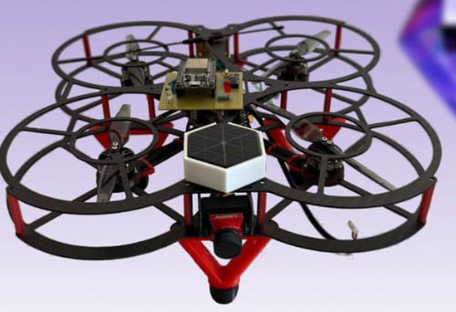
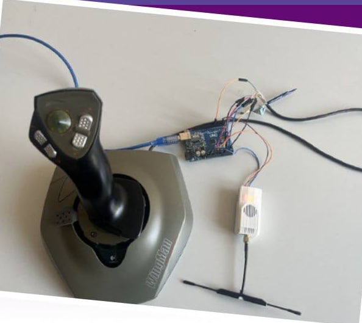

# 🛸 UAV Laser Combat System (Drone Laser Tag)

A custom open-source hardware and software stack to bring laser tag dogfights to real-world FPV/UAV drones. This project replaces standard RC transmitters with a modified PC flight stick interface and equips drones with a custom laser-firing and hit-detection payload.




## 📖 About The Project

The goal of this project is to create a fully functional, ultra-low latency aerial combat system. Instead of relying on off-the-shelf drone controllers, this system uses a custom microcontroller-based transmitter to parse inputs from a classic PC joystick and send them via the CRSF protocol over an ExpressLRS (ELRS) link.

The drone carries a custom-engineered payload board that handles incoming telemetry, fires a laser, detects hits via a photoresistor, and translates everything into a standard PPM signal for the flight controller. The firmware is heavily optimized for real-time execution, utilizing non-blocking state machines (`millis()`) to ensure the flight loop is never interrupted during combat events.

## ✨ Key Features

* **Custom TX Controller:** Reads inputs from a Logitech WingMan flight stick and translates them into CRSF packets via an Arduino.
* **Real-time Hit Detection:** Non-blocking photoresistor sampling detects incoming laser hits and triggers a hit-state without freezing the main loop.
* **PPM Encoding:** Seamlessly converts received CRSF signals and hit-states into a PPM stream for the drone's Flight Controller.
* **Full-Stack Hardware:** Features custom-designed PCBs and robust 3D-printed payload housings to keep weight minimal while protecting the electronics.
* **Audio Feedback:** Integrated non-blocking RTTTL melody player for system states (boot, hit registered, low battery warnings).

## 🛠 Hardware Architecture

**Transmitter (TX) Ground Station:**
* Logitech WingMan Joystick (Input)
* Arduino Uno (Input Processing & CRSF Generation)
* ELRS 2.4G TX Module (RF Link)

**Receiver (RX) Payload (On-Drone):**
* Custom PCB with AVR MCU (Arduino Pro Mini/Nano architecture)
* Photoresistor (Hit sensor inside a custom 3D-printed dome)
* Laser Diode Module (Weapon)
* Piezo Buzzer (Audio feedback)
* ExpressLRS Receiver

## 🚀 Repository Structure

* `/Firmware/Transmitter/` - Source code for the ground station TX controller.
* `/Firmware/Receiver/` - Source code for the drone payload, hit detection, and PPM encoding.
* `/Hardware/` - KiCad project files, PCB schematics, and board layouts.
* `/Image/` - Project photos and hardware showcases.

## 💻 How to Build & Flash

1. Clone the repository:
   ```bash
   git clone [https://github.com/yourusername/UAV-Laser-Combat-System.git](https://github.com/yourusername/UAV-Laser-Combat-System.git)